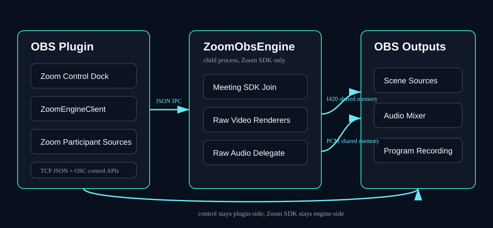
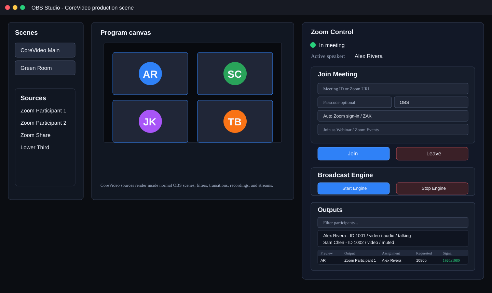
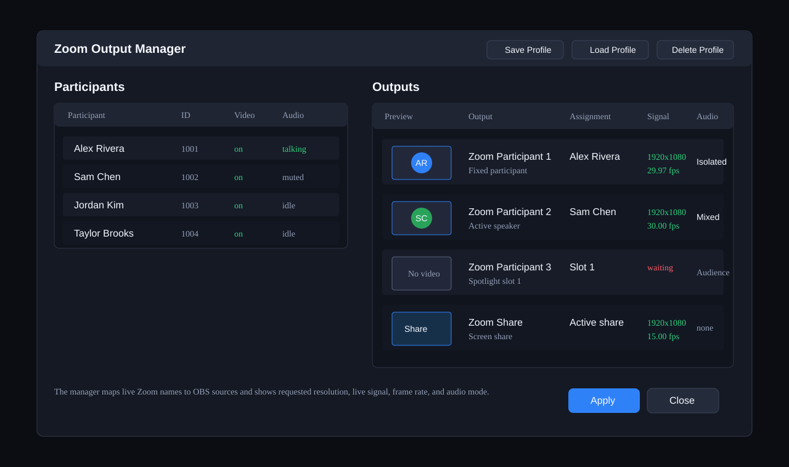
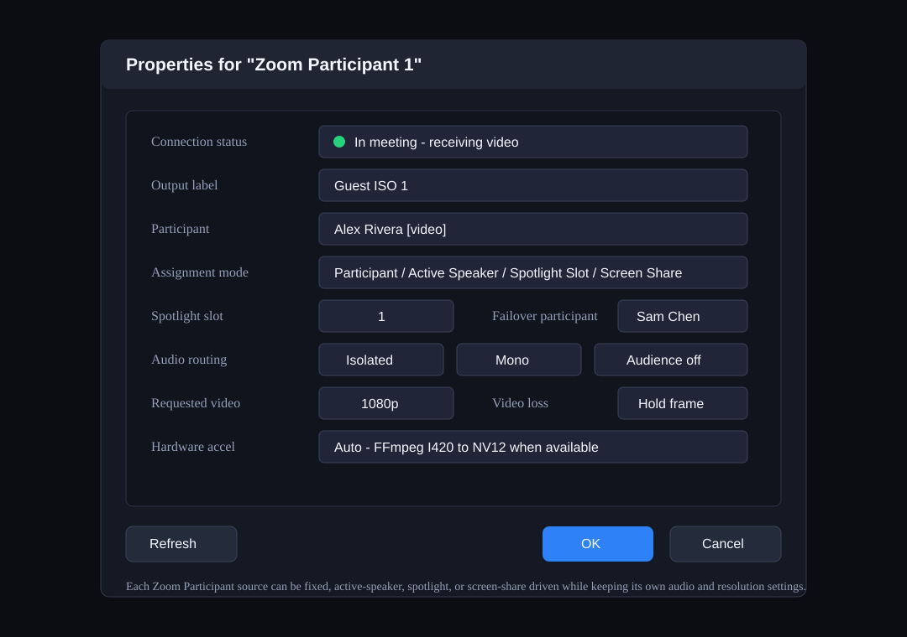
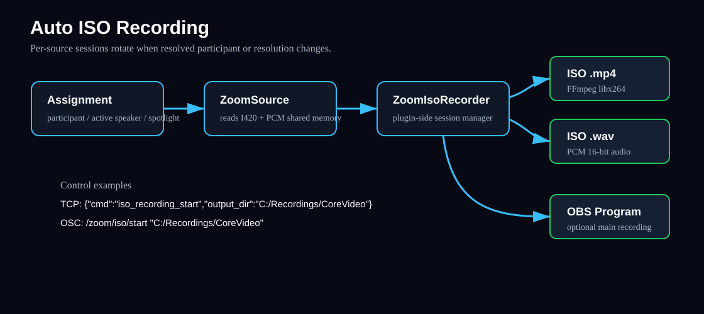

# Core Plugin Functionality

This guide covers the main CoreVideo OBS plugin workflows. It intentionally
focuses on the OBS plugin, `ZoomObsEngine`, Zoom source assignment, control APIs,
audio routing, talkback, and ISO recording.

Recommended Windows release: **v0.1.44**. macOS Apple Silicon beta:
**v0.1.45-beta.1**, available as a signed and notarized installer on the
[download page](https://corevideo.io/download/#macos). The beta also has Windows
assets; features newer than v0.1.44 are identified below. Talkback is unavailable
on macOS. The Mac package was built against OBS 32.2.1; use that version or newer.

One naming quirk to get out of the way: the OBS **sources** this plugin
registers are called `CoreVideo ...`, but its **docks and Tools menu entries**
are still called `Zoom ...`. Both are this plugin.

## Media Architecture



CoreVideo keeps all Zoom Meeting SDK access inside the lightweight
`ZoomObsEngine` helper process. The OBS plugin starts the engine, joins the
meeting, and sends subscription requests over JSON IPC. Video and audio payloads
move through named shared memory so large frames are not copied through the IPC
pipe.

The plugin-side `ZoomSource` reads the shared memory frame, outputs it into OBS,
and forwards the same copied buffer to optional plugin-side services such as ISO
recording. This keeps the engine minimal and makes OBS/plugin features easier to
test independently from the Zoom SDK.

**Current limitation (high feed counts):** All video frames travel as CPU I420
through shared memory. At 8+ concurrent 1080p sources this creates substantial
memory bandwidth pressure due to multiple per-subscription copies. See
[ROADMAP.md](ROADMAP.md) (Large-meeting capacity guidance) for exploration of
GPU texture sharing (Spout on Windows, Syphon on macOS) as a lower-CPU
alternative transport in the future.

## What It Looks Like in OBS

The CoreVideo plugin is operated from inside OBS. These diagrams mirror the
current core plugin controls: the Zoom Control dock, regular OBS scenes/sources,
the Active Speaker Director controls, the dockable profile-oriented Zoom Output
Manager, and the CoreVideo Participant source properties. Exact styling can vary
by OBS theme and platform, but the controls and labels should match the current
plugin. This guide intentionally describes the OBS plugin path; optional
Sidecar control-surface features are tracked separately in the roadmap.

The plugin docks each have a matching **Tools** menu entry that
focuses them: **Zoom Control**, **Zoom Output Manager**, **Zoom Diagnostics**,
**Zoom ISO Recorder**, and (in builds newer than v0.1.44) **Zoom Talkback**.
The Talkback dock is unavailable on macOS. **Tools > Zoom Plugin Settings**
opens the settings dialog, which is where Zoom sign-in lives.



The Zoom Control dock joins and leaves meetings, starts and stops raw media,
shows meeting state, lists participants, exposes Active Speaker Director
controls, and opens the Output Manager for source assignment without leaving OBS.



The dedicated Zoom Output Manager is the primary assignment surface. It supports
profile save/load workflows and exposes requested resolution, observed signal,
frame rate, assignment mode, screen-share/spotlight roster markers, and audio
routing information for each output. The assignment menu exposes fixed
participants, active speaker, screen share, and Spotlight 1-8 so an eight-feed
show can be routed without opening individual source properties.
Active-speaker, spotlight, and screen-share routing gaps are reported as
specific health states, so operators can tell the difference between "waiting
for the next directed speaker" and a stale or missing video feed.
It is a persistent OBS dock, so operators can keep assignments, live previews,
and feed health visible while working in normal OBS scenes. Profile loading
reports matched outputs and any saved source names that are not present in the
current OBS scene/source set before the operator clicks Apply.

Two columns exist for audio timing: **Delay (embedded)** and **A/V Offset
(embedded)**. Both act on a video source's own embedded audio track and neither
touches the dedicated CoreVideo Audio sources - see the Audio Routing section
below. **Hide participants without video** filters the
participant table, the output assignment lists, and the participant source
picker; someone with their camera off cannot be routed to an output or a tile at
all. It never hides a participant who is already assigned, so switching a camera
off cannot make a picker lose its own selection. Audio source pickers are
deliberately unaffected - a camera-off participant is often exactly who you want
a dedicated audio source for.

Open the **Zoom Diagnostics** dock, or use **Tools > Zoom Diagnostics** to focus it,
during a live session to see requested versus
observed resolution, FPS, frame age, stale and quality retry counters, and the
latest `ZoomObsEngine` debug events. This is the fastest way to see whether a
source is waiting for frames, receiving a lower-than-requested feed, or being
resubscribed by recovery logic. Use **Create Support Bundle** from this dock to
write a redacted troubleshooting bundle with engine status, output health,
recent debug events, plugin settings with tokens removed, ISO recorder and
FFmpeg encoder/session status, runtime/package validation, and the latest OBS
log when available. Bundles are written to
`%APPDATA%\obs-studio\plugin_config\obs-zoom-plugin\support-bundles\CoreVideo-support-<timestamp>\`,
and on Windows CoreVideo also creates a `.zip` beside that folder when
PowerShell is available; the dialog reports both paths. OBS log data is written
as a redacted excerpt of the last 500 lines; OAuth codes, access tokens, refresh
tokens, ZAK/JWT values, passcodes, client secrets, and authorization headers are
removed before the bundle is written. Meeting and participant names, participant
IDs, and ISO file paths are **not** redacted - read the bundle before attaching
it to a public issue.



Each CoreVideo Participant source can be configured independently for fixed
participants, active speaker, spotlight slot, screen share, isolated audio,
audience audio, resolution, video-loss behavior, and hardware conversion.

## Joining Meetings

1. Open OBS.
2. Sign in once from **Tools > Zoom Plugin Settings** with **Sign in with
   Zoom**. There is no sign-in button on the Zoom Control dock.
3. Open **Tools > Zoom Control**.
4. Enter a Zoom meeting ID or full Zoom join URL, a passcode if the meeting has
   one, and a display name.
5. Leave the join-token dropdown on **Zoom sign-in**. `User ZAK` and `App
   privilege token` are for tokens Zoom support has issued you specifically; the
   token field stays disabled and reads "Automatic from Zoom sign-in" otherwise.
6. Tick **Join as Webinar / Zoom Events** for a webinar - the SDK uses a
   different entry point for those.
7. Click **Join**.
8. Use the visible Zoom Meeting SDK window for waiting-room admission, self
   video/audio, and normal meeting controls. CoreVideo waits out a waiting room
   rather than giving up on it (v0.1.44); the two-minute join watchdog holds its
   window open for as long as the wait lasts, and is armed by this **Join**
   button only - a join issued over the control API is not watched.
9. Click **Start Engine** after joining to request raw media from Zoom.

Published builds use the embedded CoreVideo broker: the browser sign-in uses
Zoom Public Client OAuth + PKCE against `https://corevideo.iamfatness.us/oauth/start`,
CoreVideo fetches the signed-in user's ZAK, and the helper authenticates the
Meeting SDK with the embedded Marketplace Public Client ID as
`AuthContext.publicAppKey`. End users do not enter client IDs or secrets. The
site itself is `corevideo.io`; both names route to the same worker, and the
iamfatness host is the one compiled into shipped builds.

## Source Assignment

Add one or more **CoreVideo Participant** sources in OBS. Each source can follow a
different assignment mode:

| Mode | Behavior | Common Use |
|---|---|---|
| Participant | Fixed Zoom participant ID | Dedicated guest ISO |
| Active Speaker | Follows the current active speaker | Host/speaker-follow shot |
| Spotlight Slot | Follows Zoom spotlight position 1-8 | ZoomISO-style production |
| Screen Share | Follows active screen share | Slides/demo capture |

Each output reports observed resolution and frame rate through the output
manager and TCP `list_outputs` command.

### Screen Share Workflow

To capture slides, demos, or a shared desktop, add a **CoreVideo Screen Share**
source or set any **CoreVideo Participant** source to **Assignment > Active
screen share**. The source follows Zoom's active share feed and shows a
placeholder when no participant is sharing.

The Zoom Output Manager assignment menu also includes **Screen share**. When a
share is active, the menu label includes the sharing participant name. The TCP
`list_outputs` response for screen-share outputs includes:

```json
{
  "assignment_mode": "screen_share",
  "screen_share_available": true,
  "screen_share_participant_id": 123456,
  "screen_share_participant_name": "Alex Rivera",
  "observed_width": 1920,
  "observed_height": 1080,
  "observed_fps": 30.0
}
```

OSC parity is available for hardware panels and show-control systems:
`/zoom/status` replies with `/zoom/status/screen_share ,is`, subscribers receive
`/zoom/event/screen_share ,is` when the active sharer changes, and
`/zoom/list_participants` emits `/zoom/participant/detail` packets with the
`is_sharing_screen` flag plus host, co-host, raised-hand, and spotlight state.

For a single directed speaker-follow output, add the dedicated **CoreVideo Active
Speaker** OBS source. It follows the central Active Speaker Director and uses a
two-slot handoff internally: the current participant remains visible while the
next participant warms on a hidden slot, then the source cuts only after a valid
frame is available.

## CoreVideo Tiles

**CoreVideo Tiles** is one OBS source that draws every participant as a gallery
wall. Where a participant source is one person, Tiles is the whole grid: it
picks the layout for the number of people on screen, and repaints itself as
people join and leave. Add it from **Sources -> Add -> CoreVideo Tiles**.

Every tile is filled, never letterboxed. A tile narrower than the camera feeding
it crops the sides rather than adding bars, which is what keeps a wall of mixed
cameras looking even.

### Filling the wall

| Control | Does |
| --- | --- |
| **Fill mode** | `Auto - everyone with video` fills the wall with whoever currently has video, in roster order. `Manual - choose per tile` gives you a **Tile 1..N** dropdown per position, so you place people yourself. |
| **Maximum tiles** | Upper bound on how many tiles Auto mode will draw. |
| **Never show** | Participants Auto mode skips — the stage camera, a recording bot, anyone who should never land on the wall. |
| **Refresh participant list** | Re-reads the roster if someone joined while the properties dialog was open. |

### Shape and spacing

| Control | Default | Does |
| --- | --- | --- |
| **Tile shape** | `16:9 (widescreen)` | Shape of every tile: 16:9, 4:3, 5:4, 1:1 (square), 3:4 (portrait), 9:16 (vertical), or `Custom ratio`. |
| **Custom ratio (width / height)** | 16:9 | Used only when Tile shape is `Custom ratio`. |
| **Gap between tiles (% of canvas height)** | 0.741% | Space between tiles. A percentage of canvas height, so spacing scales with the canvas — 0.741% is the 8 px at 1080p the wall has always used. |
| **Margin around the wall (% of canvas height)** | 0.741% | Space between the wall and the canvas edge. |

### Background

**Background colour** fills the gutters, the margin, and any canvas the wall does
not cover. **Background source** draws any video-producing OBS source — an Image,
a Media Source, a Browser Source — behind the tiles and over that colour; leave
it on `- none -` for colour only. A background source that is deleted, or one
that would render itself (the wall, or a scene containing it), falls back to the
colour rather than breaking the wall.

### Borders and glow

| Control | Default | Does |
| --- | --- | --- |
| **Border width** | 0 (off) | Border drawn inside each tile's edge. |
| **Border colour** | black | |
| **Corner shape** | Square | `Square` or `Rounded`. |
| **Corner radius** | 16 | Shown only when Corner shape is `Rounded`. |
| **Glow size** | 0 (off) | Outer glow drawn around each tile, in a pass behind the tiles. |
| **Glow colour** | white | |
| **Glow intensity (%)** | 100 | |
| **Glow softness (%)** | 0 | How gradually the glow falls off. |

Border width and corner radius are clamped against the tile they are drawn on —
past half the shorter side there is no interior left — so an extreme value
degrades gracefully instead of inverting the tile.

### Animating layout changes

| Control | Default | Does |
| --- | --- | --- |
| **Animate layout changes** | off | Eases the whole wall when the layout changes, instead of jumping on one frame. |
| **Animation duration (ms)** | 350 | How long the wall takes to settle. 100–1000. |

With it off, the wall behaves exactly as it always has and the animator never
runs — this is not a cosmetic setting, it is a different render path.

With it on, a join or a departure re-solves the grid and every tile eases to its
new position and size. A departure is not one tile vanishing: five people
becoming four turns a 3x2 grid into a 2x2, so every remaining tile moves and
resizes regardless, and animating only the tile that changed would leave the
most visible part of the change as a hard cut.

Three behaviours worth knowing before you put it on air:

- **A newcomer fades in at its final slot** rather than flying in from an edge,
  so tiles never travel across one another to reach their positions.
- **A departure reflows immediately** — the leaving tile is not held on screen.
- **A roster blip reflows the wall out and back.** Someone dropping and
  rejoining within a moment produces a wobble rather than a pop. This is the
  deliberate trade for the wall never being behind reality.

A tile that is not moving draws through the same even-snapped path it always
has, byte for byte. Only a tile actually in motion takes the sub-pixel path, and
it returns to the pixel-exact one as soon as it settles.

### Per-tile crop

**Per-tile crop** gives each tile its own `crop left %` and `crop right %`, for
trimming a participant who is sitting off-centre without touching the others.

### Per-participant audio

The wall itself carries no audio. **Participant audio scene or group** names a
scene or group in which the wall creates one Zoom participant audio source per
tile, so every person on the wall gets their own fader and their own ISO track.
Leave it blank and nothing is created.

Points worth knowing before you switch it on:

- **Add that scene or group to every scene.** Audio then stays put while you cut
  between scenes, instead of appearing and disappearing with the wall.
- **A nested scene is safer than a group.** A group can be dissolved with
  **Ungroup**, which scatters the sources inside it.
- **Use the audio group on one Tiles source only.** If you run a second wall — a
  panel wall beside a main one — leave its audio field blank. Audio for each
  person belongs to whichever wall created it, so on a second wall someone who
  drops off that wall can be left muted while still on screen on the other one,
  and both walls number their ISO stems from track 2 up, which can put two
  people on the same stem in the recording. The plugin logs a warning if it sees
  a second wall with a group set.

## Active Speaker Director

The Active Speaker Director is controlled from the Zoom Control dock. It is not
just a pass-through of Zoom's raw active-speaker event; it builds CoreVideo's own
production decision from the raw speaker signal.

The dock shows:

- Directed speaker: the participant currently being sent to active-speaker
  outputs.
- Raw speaker: the latest speaker reported by Zoom.
- Candidate speaker: the participant waiting out the sensitivity timer.
- Last speaker: the previously directed participant.
- Status line: whether the director is waiting, holding, evaluating a
  candidate, or locked by manual supersede.
- Manual take/release: an operator supersede that holds a participant on air
  until released.

Timing controls:

| Setting | Default | Behavior |
|---|---|---|
| Sensitivity | 500 ms | Candidate must keep speaking this long before switching. |
| Hold | 2000 ms | Minimum time to stay on the current directed speaker after a cut. |

TCP examples:

```json
{"cmd":"speaker_director_status"}
```

The response includes the legacy numeric IDs plus resolved participant objects
for `directed_speaker`, `raw_speaker`, `candidate_speaker`, `last_speaker`,
`manual_speaker`, `excluded_participants`, and a `status` value such as
`holding`, `candidate_pending`, `manual_supersede`, or `waiting_for_speaker`.
Subscribed TCP clients also receive `speaker_director_changed` events when the
directed, candidate, or manual speaker changes.

```json
{"cmd":"speaker_director_configure","sensitivity_ms":650,"hold_ms":2500}
```

```json
{"cmd":"speaker_director_take","participant_id":123456}
```

```json
{"cmd":"speaker_director_release"}
```

## Audio Routing

CoreVideo has **two independent audio paths**, and knowing which one you are on
decides what guarantees you get. No code connects them.

**The dedicated path** is the audio-only OBS sources: **CoreVideo Participant
Audio**, **CoreVideo Active Speaker Audio**, and the legacy **CoreVideo Audience
Audio**. These drain the engine's 8-slot shared-memory ring in order, derive
timestamps from a running sample count rather than from arrival, count and report
anything they lose (`list_audio_sources` -> `overrun_slots`, which should stay at
`0`), and honour the global audio delay trim. **Route these to program for
anything that matters.**

**The embedded path** is the audio track a CoreVideo video source publishes
alongside its picture, configured from that source's own properties. It reads the
newest buffer only, is stamped at arrival, and has no loss accounting. It is
convenient, not lossless.

Audio modes for a video source's embedded track:

| Routing | Behavior |
|---|---|
| Mixed | Full meeting mix |
| Isolated | Only the assigned participant's one-way audio (**Isolate selected participant's audio (suppress mix)**) |
| Audience | Residual one-way audio for participants not assigned to isolated outputs |

Use **Isolated** when you need the assigned participant only. **Audience** is
kept for existing shows - its OBS source is labelled `(legacy)` - as a
remaining-room or overflow mic channel after dedicated isolated sources have
claimed named participants.

### Delay and the measured A/V offset

Video is the slower path in any software production chain, so audio arrives at
OBS ahead of its matching picture and needs delaying to line back up. There is
one control per path, and each moves only its own:

- **Tools > Zoom Plugin Settings > Audio > Audio delay (dedicated sources)** is a
  single global trim, 0-500 ms, for every dedicated CoreVideo Audio source. It
  takes effect on the next audio buffer, including on sources already running.
- The Output Manager's per-row **Delay (embedded)** trims one video source's own
  embedded track, and **A/V Offset (embedded)** is the measured number to trim it
  against. The offset is `video_latency_us - audio_latency_us` measured from
  engine capture to OBS publish: positive means audio is early by that many
  milliseconds, which is what to dial into Delay. It reads `-` until both
  latencies have actually been measured.

Delay can only ever push audio later; it can never advance it. Trim off air -
lowering a delay pushes the timestamp backward once and briefly glitches the
affected source.

The same field is settable over TCP. Omit it entirely on unrelated calls, such as
a plain reassignment, or it resets to 0:

```json
{"cmd":"assign_output","source":"CoreVideo Participant 1","participant_id":123456,"audio_delay_ms":80}
```

### Silence is a Zoom property, not a dropout

Zoom only calls audio back for a participant who is currently making sound, so a
silent stretch produces no buffers at all rather than buffers of silence. Two
consequences CoreVideo handles and one it cannot: the master clock resyncs rather
than letting a quiet participant walk steadily into the past; the first buffer
after a run of true digital silence is ramped in over a few milliseconds so the
resumption does not click; and speech the far end never sent stays missing.

## Talkback (Intercom)

**Windows only, newer than v0.1.44.** The Talkback dock is included in the
Windows v0.1.45-beta.1 build. It is not in the recommended v0.1.44 installer,
and macOS does not implement talkback.

Talkback is private director-to-talent audio carried over Zoom's own talkback
channels - the operator can talk to one person, or to everyone, without the
meeting or the program mix hearing it. Open it from **Tools > Zoom Talkback**,
or as the **Zoom Talkback** dock.

The dock is modelled on a Clear-Com/RTS intercom panel rather than on a list of
settings: one grid, **All talent** across the top, then one compact cell per
person. A cell is the talk key and the status display at the same time.

### Assigning channels first

Zoom channels are **created at assignment time, never at key time**. A key press
only looks its target up in the standing channel set and starts sending, because
creating a channel on the press costs a create round trip plus an invite round
trip - measured live as the director's first syllable being discarded on every
press.

1. Press **Edit talent**. The grid is replaced by a tick-box list of the roster,
   so exactly one list of people is on screen at a time.
2. Tick everyone you may need to talk to.
3. Press **Assign channels (N)**, or **Clear all channels** when nothing is
   ticked.
4. Press **Done** and read the plan report.

Zoom allows **16 channels and 10 people per channel**. The plan report says how
many channels are in use, who has a private channel, who has no private channel
and must be reached through All talent, and who is on no channel at all and
therefore hears nothing. Anyone the budget cannot cover is named rather than
silently dropped.

Assignment is not instant. Zoom rate-limits channel and membership calls -
undocumented, and refused with `SDKERR_TOO_FREQUENT_CALL` - so CoreVideo paces
every create and every invite at one call per 600 ms. A large talent list can
take around twenty seconds to fully provision and confirm. That cost is paid once
at assignment and never at key time.

Talent are stored **by display name**, never by Zoom user ID: IDs are
meeting-scoped, so someone who drops and rejoins gets a new one. CoreVideo
re-resolves membership from the roster with no operator action.

### Keying

- Choose the OBS audio source you talk through in the dock's source combo. No key
  is pressable until you do. Use a dedicated source with every program track
  unchecked in Advanced Audio Properties.
- The line under the combo says whether that source is going out on a program
  track - `Off program (safe)`, or `On air via track N. The audience will hear
  this.`
- Hold a cell to talk. Tick **Latch** to make one press open the key and the next
  close it. Whether a press closes an open key is decided from the mode it was
  opened with, so changing Latch mid-key cannot strand it.
- **Only one key is open at a time, anywhere** - including a key opened by the
  control API or Companion, which the dock shows but will not close.
- A short tone confirms open and close, on the engine's confirmed live edge
  rather than on the button press.
- The banner at the top is the authority on whether you are audible. It reads
  `Off air`, `Keying <target>`, `ON AIR: <target>`, `Key refused: <target>`, or
  `ON AIR - BOT MUTED: <target>`.

### What a cell says

| Cell state | Means |
|---|---|
| `ready` | They have a channel and are in it. |
| `ON AIR` | The key is open and the engine has confirmed it. |
| `assigning...` | The channel ladder is still provisioning. Keys are refused, never half-honoured. |
| `no channel` | The budget could not cover them. Assign channels again with fewer people. |
| `not in channel` | They have a channel but are not in it - most often a different breakout room. |
| `no talkback` | Their Zoom client reported no talkback support, or nothing reaches them. |
| `some missed` | On the All talent cell: the plan is short, so this key does not reach everybody. |

### Three delivery rules that are silent in the failure direction

None of these is documented by Zoom. Each was found live, and each fails quietly.

1. **Talkback delivers only while CoreVideo's own meeting audio is open.** Muted,
   `SendAudioDataToChannel` returns success, members are confirmed, and everyone
   hears silence. CoreVideo unmutes itself at key time and re-asserts every two
   seconds in case a host re-mutes it. If Zoom refuses the unmute the key is
   still allowed - the channels are real and a host can still unmute - but the
   banner reads **ON AIR - BOT MUTED** and drops the member tally, because "3 of
   3 present" beside "nobody can hear you" is the instrument that made this
   invisible in the first place.
2. **Talkback reaches only the breakout room the engine is in.** A talent in
   another room shows `not in channel` and hears nothing, no matter how healthy
   the channel looks.
3. **Sends are mono.** The SDK accepts stereo and silently delivers nothing, so
   CoreVideo downmixes at the boundary. Only the sample rates the SDK documents
   are accepted; anything else is refused loudly rather than resampled.

Channel membership is acoustically neutral until a key is pressed. Zoom appears
to create channels already ducked, so CoreVideo sets each channel's background
volume to unity at creation, before any invite, and ducks to 30% only while a key
is live.

### Talkback over the control API

The dock and the TCP control API are the only keying surfaces today - there are
no OSC addresses, no Companion actions, and no OBS hotkey for talkback yet.

`talkback_nominate` and `talkback_key` are fire-and-acknowledge: the response
only confirms the trigger was accepted. The plan outcome arrives asynchronously
as `"cmd":"talkback_nominate"` lines in the OBS log, and is polled through
`talkback_status`.

```json
{"cmd":"talkback_nominate","nominees":["Alex Rivera","Sarah Muller"]}
```

```json
{"cmd":"talkback_key","state":"on","target":"Alex Rivera","source":"Director Mic","mode":"push_to_talk"}
```

```json
{"cmd":"talkback_key","state":"off"}
```

`target` is `"all"` or a nominee's display name. `mode` is `push_to_talk`
(default) or `latch`. A key opened this way must be renewed with
`{"cmd":"talkback_renew"}` - a surface whose release can be lost in transit has
to prove it is still there. `{"state":"off"}` always succeeds.

```json
{"cmd":"talkback_status"}
```

The reply carries the live key state and a `nomination` object holding the
**confirmed** plan - who has a private channel, who is uncovered, who is
unreachable - plus `last_attempt_ok` and `last_attempt_reason`, which describe the
most recent attempt separately and can disagree with the confirmed plan without
corrupting it.

`{"cmd":"talkback_probe","participant":"<display name>"}` is a diagnostic, also
reachable from the collapsed **Diagnostic: talkback probe** section at the bottom
of the dock. It opens a channel, invites that one participant, sends a
three-second 440 Hz tone **that they will hear**, ducks their meeting audio for
its duration, and destroys the channel. It requires host or co-host; a plain
participant is refused with `SDKERR_NO_PERMISSION`.

## Companion / Stream Deck

`companion/companion-module-corevideo-obs` is a Bitfocus Companion module
speaking the same TCP control API. It requires **Companion v5 or later** -
earlier builds cap the module API at 1.12 and cannot load it at all.

Actions are `zoom_join`, `zoom_leave`, `zoom_assign`, `zoom_assign_spotlight`,
`zoom_assign_screen_share`, and `zoom_cancel_recovery`. Both the output and the
participant are dropdowns on `zoom_assign`, populated from the module's own live
state, and the same output picker is on the spotlight and screen-share actions.
Participants are offered and stored **by name**,
because Zoom user IDs are meeting-scoped: a button holding a raw ID points at
nobody after a rejoin, and at the wrong face once IDs are recycled. The ID is
resolved from the name against the live roster at press time; a name not in the
meeting resolves to nobody and logs a warning rather than guessing. Raw numeric
IDs still work, and buttons built before this change still work through the
legacy `participant_id` option.

There are no Companion actions for talkback yet.

## Auto ISO Recording



ISO recording is controlled by the OBS plugin, not the engine. When enabled,
On macOS, configure and test a working FFmpeg executable in **Zoom ISO Recorder**
first; the package does not bundle FFmpeg.

CoreVideo records one video file and one PCM WAV audio file per active source
segment. A new segment starts when the resolved participant or source resolution
changes.

Requirements:

- `ffmpeg` must be available on `PATH`, or pass an explicit `ffmpeg_path`.
- Raw media must be active.
- Sources must be assigned to participant, active speaker, or spotlight modes.

### OBS ISO Recorder Panel

Open **Tools > Zoom ISO Recorder** to manage ISO recording from a separate OBS
dock. The panel provides:

- Output folder picker.
- FFmpeg executable field with a test button.
- Video encoder selector for CPU x264, NVIDIA NVENC, Intel Quick Sync, or AMD
  AMF when the selected FFmpeg build supports that encoder.
- Encoder guidance explaining CPU load, GPU encoder-session limits, and when to
  fall back to CPU x264 for 8 ISO feeds plus a program stream.
- Safe hardware fallback: if the selected hardware encoder is missing from the
  FFmpeg build, CoreVideo falls back to `libx264` when available and reports the
  requested encoder, actual encoder, and fallback state.
- **Also start/stop OBS program recording** toggle.
- **Start ISO Recording** and **Stop ISO Recording** buttons.
- Live status showing idle/recording and active session count.
- Active session table with source, participant, resolution, video frame count,
  audio chunk count, current video/audio file paths, and FFmpeg error details.
- Recently completed sessions remain in the table after stop so operators can
  confirm completed MP4/WAV outputs before opening the folder.

The panel uses the same `ZoomIsoRecorder` backend as the TCP and OSC APIs. It
persists the output folder, FFmpeg path, and program-recording toggle in OBS
global settings. Recording start is blocked when the selected output volume has
less than 2 GB free and warns below 10 GB free.

TCP start example:

```json
{"cmd":"iso_recording_start","output_dir":"C:/Recordings/CoreVideo","ffmpeg_path":"ffmpeg","record_program":true}
```

TCP status example:

```json
{"cmd":"iso_recording_status"}
```

TCP stop example:

```json
{"cmd":"iso_recording_stop"}
```

OSC equivalents:

| Address | Type tags | Action |
|---|---|---|
| `/zoom/iso/start` | optional `,ssi` | Start ISO recording with optional output directory, video encoder, and record-program flag |
| `/zoom/iso/status` | none | Reply with active sessions, completed sessions, requested/actual encoder, fallback, hardware, disk warning, and recorder warning |
| `/zoom/iso/stop` | none | Stop ISO recording |

Output files are written as:

- `*.mp4` for encoded I420 video through FFmpeg using the selected H.264
  encoder
- `*.wav` for matching PCM audio
- `*.ffmpeg.log` beside them, holding FFmpeg's own account of the session. Read
  this first when a file is missing or truncated.

### Timing

Both files are paced to real elapsed time against the same clock, so each is
individually accurate and the two stay in sync with each other.

That is not free, and it is worth knowing why. Raw video carries no per-frame
timestamps, and Zoom's per-source delivery fluctuates between roughly 10 and
60 fps with conditions outside CoreVideo's control - so frames are paced to a
fixed cadence before they reach FFmpeg, duplicating the held frame to backfill a
stall and dropping excess from a burst. Audio has the mirror-image problem for a
different reason: Zoom only calls audio back for someone currently making sound,
so silence is backfilled across every gap or the WAV shrinks by the total silent
duration. Both were wrong before v0.1.42/v0.1.43 - a source averaging 15 fps
recorded under a declared 30 fps finished in about half the real duration, and an
over-eager first gap-fill briefly doubled every WAV. If you see either symptom,
check your version first.

The hardware encoder fallback chain is NVENC -> QSV -> AMF -> libx264, and it
walks the whole chain: a source demoted off NVENC on a machine with no working
QSV or AMF runtime now reaches libx264, the tier with no hardware dependency to
fail on.

When `record_program` is true, CoreVideo also starts the normal OBS program
recording and stops it when ISO recording stops, but only if CoreVideo started
that OBS recording session.

## TCP Control Examples

All TCP commands are newline-delimited JSON sent to `127.0.0.1:19870`.

List participants:

```json
{"cmd":"list_participants"}
```

List outputs:

```json
{"cmd":"list_outputs"}
```

Output snapshots include requested resolution, observed resolution/FPS, stale
state, last frame age, subscribed age for outputs still waiting on their first
frame, recovery attempts, automatic quality-upgrade attempts, and remaining
retry cooldowns.

The **Cancel Recovery** button, TCP `recovery_cancel`, and OSC
`/zoom/recovery/cancel` all use the same stop path: CoreVideo cancels pending
reconnect timers, stops the engine process, and clears the stored join session
so a canceled retry loop cannot restart itself.

Force a retry for stale outputs:

```json
{"cmd":"recover_stale_outputs","force":true}
```

Force a quality retry for live outputs below their requested resolution:

```json
{"cmd":"upgrade_low_quality_outputs","force":true}
```

Quality retries are skipped when a feed is already observed at 1080p.

Assign a source to a fixed participant with isolated mono audio:

```json
{"cmd":"assign_output_ex","source":"CoreVideo Participant 1","mode":"participant","participant_id":123456,"isolate_audio":true,"audio_channels":"mono","video_resolution":"1080p"}
```

Assign a source to active speaker:

```json
{"cmd":"assign_output_ex","source":"CoreVideo Participant 2","mode":"active_speaker","audio_channels":"mono","video_resolution":"1080p"}
```

Inspect and control the Active Speaker Director:

```json
{"cmd":"speaker_director_status"}
```

```json
{"cmd":"speaker_director_configure","sensitivity_ms":650,"hold_ms":2500}
```

```json
{"cmd":"speaker_director_take","participant_id":123456}
```

```json
{"cmd":"speaker_director_release"}
```

Assign a source to spotlight slot 1:

```json
{"cmd":"assign_output_ex","source":"CoreVideo Participant 3","mode":"spotlight","spotlight_slot":1,"audio_channels":"mono","video_resolution":"1080p"}
```

## OSC Control Examples

List participants and outputs:

```text
/zoom/list_participants
/zoom/list_outputs
/zoom/list_assignments
```

`/zoom/list_assignments` replies with one `/zoom/output/assignment` message per
CoreVideo source:

```text
/zoom/output/assignment "CoreVideo Participant 1" "participant" 123456 "Alex Rivera" 123456 "Alex Rivera" 1 0
```

Arguments are `source`, `mode`, configured participant ID/name, resolved
participant ID/name, spotlight slot, and failover participant ID. Active-speaker
sources resolve to the current directed speaker.

Retry stale video outputs:

```text
/zoom/recover_stale_outputs 1
```

Retry low-quality video outputs:

```text
/zoom/upgrade_low_quality_outputs 1
```

Inspect and control the Active Speaker Director:

```text
/zoom/speaker_director/status
/zoom/speaker_director/configure 650 2500 1 123456 789012
/zoom/speaker_director/take 123456
/zoom/speaker_director/release
```

The OSC status request preserves the original numeric
`/zoom/speaker_director/status` reply and also sends
`/zoom/speaker_director/status/detail ,iiiiiiiiiiiis`, including directed, raw,
candidate, last, manual, sensitivity, hold, require-video, candidate elapsed,
hold remaining, two exclusion IDs, and status text such as `holding`,
`candidate_pending`, or `manual_supersede`.

Assign a source:

```text
/zoom/output/assign_ex "CoreVideo Participant 1" "participant" 123456 1
```

Assign active speaker:

```text
/zoom/assign_output/active_speaker "CoreVideo Participant 1"
```

Set isolated audio:

```text
/zoom/isolate_audio "CoreVideo Participant 1" 1
```

Start and stop ISO recording:

```text
/zoom/iso/start "C:/Recordings/CoreVideo" "h264_nvenc" 1
/zoom/iso/status
/zoom/iso/stop
```

## Troubleshooting

| Symptom | Check |
|---|---|
| Color bars only | Confirm the meeting is joined, raw media is started, and the source has a participant/role assignment. |
| No isolated audio | Confirm the source is assigned to a real participant and `isolate_audio` is true. |
| ISO recording does not start | Confirm `ffmpeg` is on PATH or provide `ffmpeg_path`; read the session's `.ffmpeg.log`. |
| External meeting rejected | Confirm the Meeting SDK app/client ID is approved or published for external meeting joins. |
| Plugin cannot launch engine | Confirm `ZoomObsEngine.exe` and the Zoom SDK runtime DLLs are installed under `obs-plugins/64bit/zoom-runtime`. The plugin looks there first, then beside its own DLL. A DLL-only copy is the most common self-inflicted failure - install both binaries as a pair. |
| Every source black after a breakout room | Zoom revokes the raw-recording privilege on breakout entry without disconnecting you. Re-requested automatically since v0.1.40; on older builds, stop and start raw media. |
| Audio breaks up on every source at once | Look for an orphaned `ZoomObsEngine.exe` from a previous OBS session ghost-writing the same shared memory. Swept automatically at launch since v0.1.41. |
| Talkback key says live but nobody hears | Read the banner. **ON AIR - BOT MUTED** means Zoom refused the unmute; a cell reading `not in channel` usually means a different breakout room. |
| Join sits on "joining" forever | Either a waiting room (normal - CoreVideo waits) or your own account already hosting elsewhere, which now fails loudly with `account_busy_elsewhere` / `909001`. |

Full troubleshooting, log collection, and the support-bundle walkthrough are on
the [Support page](https://corevideo.io/support/).
